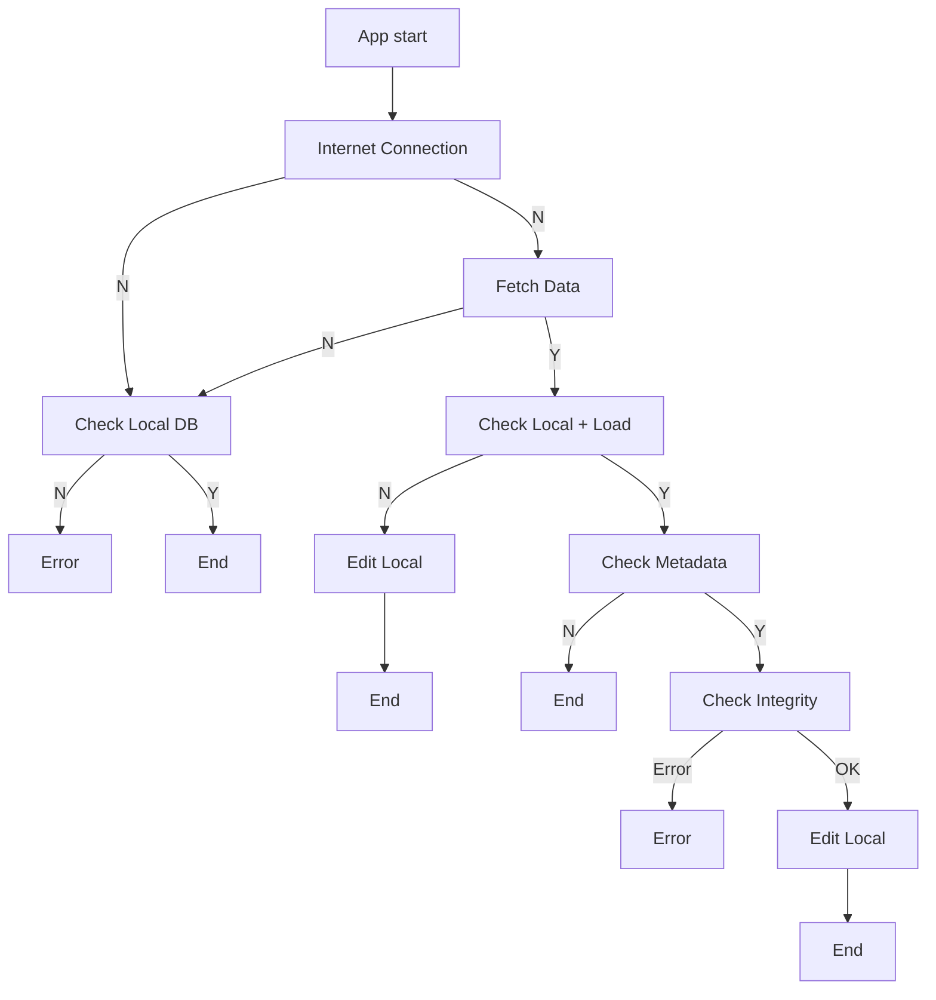

# food.duck()

🦆2023 여름방학 Flutter 토이 프로젝트  

궁극의 미식봇 기반 진화형 맛집 추천 프로그램입니다.
앱은 Flutter를 이용하여 만들고, 서버 데이터는 FireBase에 저장하는 구조입니다.

## Current Feature List
- null

## Filesystem Info
- main : 두 팀의 코드의 Integrating 이 끝난, 가장 최신 Release-Ready Build 가 저장된 폴더입니다.
- front : 프론트엔드 팀의 작업에 사용하는 폴더입니다.
- back : 백엔드 팀의 작업에 사용하는 폴더입니다. 


## Todo
- Make app interface and pages
- Firebase integration

<hr>

# 백엔드

## 목표
백엔드 팀의 목표는 데이터가 저장된 json 파일을 파싱하여 앱에 필요한 포맷으로 바꾸는 것.
## json parsing in flutter
### json
json(JavaScript Object Notation)은 JavaScript 객체의 형식으로 기록한 데이터다. json으로 저장된 데이터는 JavaScript의 객체 형식을 직, 간접적으로 사용하는 언어에서 javaScript 객체로 파싱하여 사용할 수 있다.
json의 형식은 다음과 같이 정리된다:
- 중괄호는 객체를 의미한다. 중괄호 안에는 객체의 데이터가 들어간다.
- 객체의 모든 property-value는 기본적으로 Map<String, dynamic> 형태이다. 즉, 객체의 모든 property는 문자열의 형태로 그 이름이 저장된다. 문자열 다음에는 속성의 값이 나열 되며, property와 value는 :로 구분되고 데이터 쌍 끼리는 ,로 구분된다.
- 대괄호는 배열을 의미한다. 배열 안에는 dynamic 형태가 들어가며, 각 원소는 ,로 구분되고, 중첩이 가능하다.

본격적인 코드에 착수하기 전에 필요한 데이터를 정리한 결과는 다음과 같다:
#### Data
- 식당 이름
- 식당 주소
- 식당 주변 지도
- 식당 사진
- 음식 카테고리
- 식당 태그
    - 주요 메뉴
    - 거리 관련 태그
    - 메뉴 가격
- 영업 시간

또한 이를 기반으로 1차적으로 정리한 json의 형식은 다음과 같다:
```json
[
  {
   "name" : "A",
   "address" : "p1",
   "category" : "한식",
   "trav_time" : "1",
   "tag" : [
      "t1","t2","t3" 
   ],
   "opentime" : [
   ],
   "image" : "urlurlurlurl"
  },
  {
   "name" : "B",
   "address" : "p2",
   "category" : "일식",
   "trav_time" : "2",
   "tag" : [
      "t3","t4"
   ],
   "opentime" : [
   ],
   "image" : "urlurlurlurl"
  }
]
```
물론 확정된 사항은 아니며, 앱이 데이터를 가져오는 형식, 혹은 앱이 효율적으로 데이터를 저장하기 위한 자료구조에 따라 json 파일의 형식은 얼마든지 바뀔 수 있다.

### Functions?
- internet connection : 인터넷이 연결되었는지 확인한다.
- Local DB : 로컬 DB, 기기 내에 DB가 있는 지 확인하고, 
- Metadata : 메타데이터를 통해 업데이트가 필요한 지 확인한다.
- Data Fetch : 서버에 있는 DB에서 데이터를 가져온다.
- Integrity : 데이터의 무결성을 확인한다.
- Local File Manipulation : 서버 데이터를 로컬 DB에 덮어 씌운다. 
<hr>



### API

- FireBase: 백엔드를 다루기 위한 프레임워크다.
    [Cloud Firestore로 데이터 가져오기 | Firebase](https://firebase.google.com/docs/firestore/query-data/get-data?hl=ko)
    [firebase_core | Flutter Package](https://pub.dev/packages/firebase_core)
    [googleapis | Dart Package](https://pub.dev/packages/googleapis)
- Google Maps API: 지도 기능을 사용하기 위한 API다.
    [시작하기 전에 | Google Maps for Flutter | Google for Developers](https://developers.google.com/maps/flutter-plugin/overview?hl=ko)
    [google_maps_flutter | Flutter Package](https://pub.dev/packages/google_maps_flutter)
